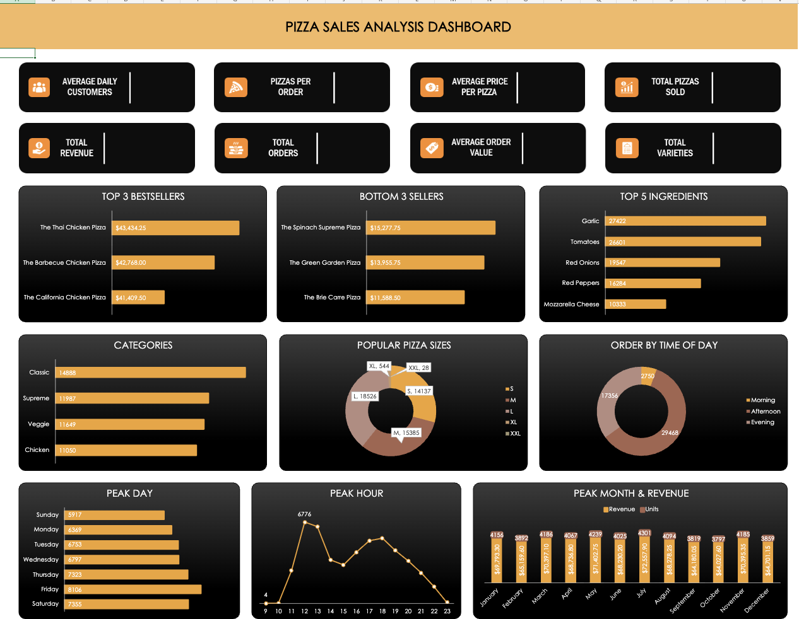

# 🍕 Pizza Sales Analysis Dashboard


## 📑 Table of Contents

- [Project Overview](#-project-overview)
- [Data Model](#-data-model)
- [Key Insights](#-key-insights)
- [Strategic Recommendations](#-strategic-recommendations)
- [Tools Used](#-tools-used)
- [Project Structure](#-project-structure)
- [Skills Demonstrated](#-skills-demonstrated)

---

# 📌 Project Overview

This project presents a comprehensive analysis of one year of pizza sales data to uncover business insights related to customer behavior, sales performance, product demand, and revenue trends.

The analysis was performed using **SQL** for querying and business analysis, while **Microsoft Excel** was used to create an interactive dashboard and KPI reports.

### 🎯 Objectives

- Identify best and worst-selling pizzas.
- Analyze sales by category and pizza size.
- Discover peak ordering hours and days.
- Analyze monthly sales trends.
- Generate actionable business recommendations.

---

# 🗂️ Data Model

The project uses four relational tables.

- **Orders** – Stores Order ID and Order Date & Time.
- **Order Details** – Stores Quantity and Pizza ID.
- **Pizzas** – Stores Pizza Size and Price.
- **Pizza Types** – Stores Pizza Name, Category and Ingredients.

## Entity Relationship Diagram


---

# 📊 Key Insights

## 🔝 Pizza Sales Performance

- Thai Chicken Pizza generated the highest revenue.
- Brie Carre Pizza generated the lowest revenue.
- Classic pizzas received the highest number of customer orders.

## 🍕 Category & Size Analysis

- Classic category was the most popular.
- Large pizzas contributed the highest sales.
- XL and XXL pizzas generated the lowest sales.

## 🧄 Ingredient Analysis

- Garlic was the most frequently used ingredient.
- Tomatoes and Red Onions ranked among the most demanded ingredients.
- Mozzarella Cheese contributed significantly to total revenue.

## ⏰ Time-Based Analysis

- Afternoon recorded the maximum number of orders.
- Friday generated the highest sales.
- July recorded the highest monthly revenue.

---

# 📈 Dashboard Preview



---

# 💡 Strategic Recommendations

### 1️⃣ Promote Best Sellers

Bundle high-performing pizzas with beverages or desserts to increase average order value.

### 2️⃣ Improve Low-Selling Products

Offer promotional discounts and redesign recipes for low-performing pizzas.

### 3️⃣ Increase Weekend Sales

Launch family meal combos and weekend special offers.

### 4️⃣ Optimize Staffing

Allocate more staff during Friday afternoons and other peak hours.

### 5️⃣ Seasonal Campaigns

Run promotional campaigns during lower-performing months.

### 6️⃣ Personalized Marketing

Recommend pizzas based on previous customer purchase behavior.

---

# 🛠️ Tools Used

- SQL
- Microsoft Excel
- Data Analysis
- Dashboard Design
- Data Visualization

---

# 📂 Project Structure

```text
Pizza-Sales-Analysis-Dashboard
│
├── Pizza Place Sales Dataset
├── Queries & Insight
├── Excel Metrics.md
├── Pizza ER Diagram.png
├── Pizza Sales Insight Dashboard.xlsx
├── Pizza Sales Insight_ppt.pdf
├── banner.png
├── dashboard.png
└── README.md
```

---

# 🚀 Skills Demonstrated

- SQL Query Writing
- Data Cleaning
- Data Analysis
- KPI Development
- Dashboard Design
- Business Intelligence
- Data Visualization
- Analytical Thinking

---

## ⭐ If you found this project helpful, consider giving it a star!
